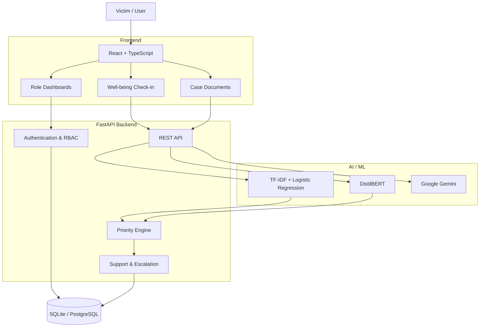

<h1 align="center">SAHAYA</h1>

<p align="center"><strong>The AI flags. A human decides.</strong></p>

<p align="center">AI-Powered Dynamic Mental Health Monitoring and Distress Support System</p>

<p align="center">
  
  
  
  
</p>

<p align="center"><strong>Team CodeYappers</strong></p>

---

<h1 align="center">Contents</h1>


- [Overview](#overview)
- [Problem](#problem)
- [Solution](#solution)
- [Key Features](#key-features)
- [Tech Stack](#tech-stack)
- [Architecture](#architecture)
- [Getting Started](#getting-started)
- [Usage by Role](#usage-by-role)
- [Project Structure](#project-structure)
- [Impact](#impact)
- [Future Scope](#future-scope)
- [References](#references)
- [Team](#team)
- [License](#license)

---

<h1 align="center">Overview</h1>


SAHAYA is an AI-powered well-being monitoring and support platform for victims and complainants under the SC/ST (Prevention of Atrocities) Act, across investigation, trial and rehabilitation.

Legal proceedings move through fixed milestones, while a person's well-being changes continuously in between. SAHAYA adds a structured support layer of consent-based check-ins, explainable ML signals, deterministic prioritisation and human-routed escalation.

SAHAYA is a support tool, not a diagnostic system. All demonstration data is synthetic.

<h1 align="center">Problem</h1>


- No continuous well-being monitoring between case milestones
- Support requests are disconnected from case workflows
- Support needs are prioritised manually
- Case and support information is fragmented
- Limited coordination between victims, counsellors and administrators
- Automated systems risk making inappropriate decisions

**Core challenge:** how can changing distress signals be identified early while keeping responsibility and intervention with humans?

<h1 align="center">Solution</h1>


SAHAYA is a human-in-the-loop pipeline that connects well-being monitoring to authorised human intervention.

```
Well-being Check-in -> ML Analysis -> Priority Classification -> Human Escalation -> Support / Counselling -> Audit Record
```

The AI provides the signal. Humans make the decision.

<h1 align="center">Key Features</h1>


**Role-based access.** Victims/Users, Counsellors, District, State and National Administrators.

**Well-being check-ins.** Open-ended responses through text, voice and AI-assisted interaction.

**ML analysis.** A TF-IDF + Logistic Regression baseline returns a prediction with confidence. A supplemental DistilBERT emotion model (`bhadresh-savani/distilbert-base-uncased-emotion`) adds a signal across sadness, joy, love, anger, fear and surprise. It is not a distress classifier or a clinical model.

**Deterministic priority classification.** Signals are converted into `HIGH`, `STANDARD` or `REVIEW`.

**Policy-constrained AI support.** Google Gemini provides calm assistance and does not perform medical or psychological diagnosis.

**Human escalation.** Support activity is routed to counsellors or authorised administrators by role and assignment.

**Administrative hierarchy.** National, State, District, Counsellor. Scope is enforced by backend checks, not only frontend visibility.

**Voice support.** Browser speech recognition with a server-side Gemini transcription fallback. `pyttsx3` provides Read Aloud.

**Case and activity tracking.** Check-ins, support requests, case documents, notifications and actions are recorded for authorised access.

<h1 align="center">Tech Stack</h1>


| Layer | Technology |
|---|---|
| Frontend | React, TypeScript, TailwindCSS, Axios |
| Backend | FastAPI, Python, SQLAlchemy, Pydantic |
| Database | SQLite (development), PostgreSQL (planned) |
| Authentication | JWT, bcrypt |
| Machine Learning | scikit-learn (TF-IDF, Logistic Regression), DistilBERT |
| AI Support | Google Gemini API |
| Voice | SpeechRecognition, Gemini, pyttsx3 |

Planned: Twilio-based OTP authentication.

<h1 align="center">Architecture</h1>




<h1 align="center">Getting Started</h1>


**Prerequisites:** Python 3.10+, Node.js and npm, Git, and a Gemini API key for AI features.

**1. Clone**

```bash
git clone https://github.com/Nil-0107/SAHAYA_1.0.git
cd SAHAYA_1.0
```

**2. Backend**

```bash
cd backend
python -m pip install -r requirements.txt
python -m uvicorn app.main:app --host 127.0.0.1 --port 8000 --reload
```

Create `backend/.env` and restart FastAPI after any change:

```env
GEMINI_API_KEY=your_key_here
GEMINI_MODEL=gemini-3.8-flash
```

**3. Frontend**

```bash
cd frontend
npm install
npm run dev
```

The frontend expects the API at `http://127.0.0.1:8000/api/v1`.

**4. Seed demo data (development only)**

```bash
SAHAYA_ENV=development python3 -m app.db.init_db
SAHAYA_ENV=development python3 -m app.demo.seed_demo
```

Alternatively: `SAHAYA_ENV=development ./scripts/seed-demo.sh`

Demo accounts are listed in `docs/DEMO_ACCOUNTS.md`.

<h1 align="center">Usage by Role</h1>


| Role | Capabilities |
|---|---|
| Victim / User | Complete check-ins by text or voice, receive AI-assisted support, upload case documents, request human support, view authorised well-being information |
| Counsellor | View assigned users, receive relevant case notifications, review authorised support information |
| Administrators | Manage the hierarchy and counsellor assignments, review authorised cases, monitor support requests and notifications |

<h1 align="center">Project Structure</h1>


```
SAHAYA_1.0/
├── backend/          FastAPI application
├── frontend/         React + TypeScript application
├── docs/             Documentation and demo accounts
├── scripts/          Setup and seeding scripts
├── logistic_regression_emotion_model(1).joblib
├── tfidf_vectorizer(1)(1).joblib
├── SAHAYA_OPENCODE_MASTER_BUILD_SPEC.md
├── WINDOWS_SETUP.md
├── backend_sahaya.pdf
├── prd_sahaya(1).pdf
├── ui_sahaya.pdf
└── sahaya_dynamic_distress_ui_updated.html
```

<h1 align="center">Impact</h1>


- **Social:** continuous monitoring, earlier visibility of changing support needs, accessible text and voice interaction
- **Institutional:** structured support workflow, role-scoped case access, faster routing, centralised notifications and records
- **Responsible AI:** human-in-the-loop decisions, explainable ML signals, no autonomous diagnosis, server-side AI processing

<h1 align="center">Future Scope</h1>


- Twilio OTP authentication
- PostgreSQL production deployment
- Multilingual Indian-language support
- Improved domain-specific ML models
- Longitudinal well-being analytics
- Android and iOS applications
- Professional counselling-service integration
- Advanced audit and reporting
- Production-grade security and encryption

<h1 align="center">References</h1>


- scikit-learn: TF-IDF and Logistic Regression
- Hugging Face DistilBERT: emotion classification
- DAIR.AI Emotion Dataset: six-class emotion data
- Google Gemini API: AI support and transcription
- FastAPI, React, TypeScript, SQLAlchemy

<h1 align="center">Team</h1>


**Smart India Hackathon 2026** | Problem Statement SIH26094 | MedTech / HealthTech | Software | Team CodeYappers

| Member | Role |
|---|---|
| Swapnil Das | Team Lead, Backend and Architecture |
| Udit Prasad | Backend |
| Joy Saha | Frontend |
| Debolina Ghosal | Frontend |
| Anupama Modak | PPT Presenter |
| Ankona Gope | Pitching and Presenting |

**Mentor:** Indranil Sarkar, CSE Department

<h1 align="center">License</h1>


Distributed under the MIT License. See the [LICENSE](LICENSE) file for details.

---

<p align="center"><strong>SAHAYA: The AI flags. A human decides.</strong></p>
lchemy — Database ORM

---

Smart India Hackathon 2026

Field| Details
Project| SAHAYA
Problem Statement| SIH26094
Theme| MedTech / HealthTech
Category| Software
Hackathon| Smart India Hackathon 2026
Team| CodeYappers

---

Team

Member| Role
Swapnil Das| Team Lead / Backend & Architecture
Udit Prasad| Backend
Joy Saha| Frontend
Debolina Ghosal| Frontend
Anupama Modak| PPT Presenter
Ankona Gope| Pitching & Presenting

Mentor

Indranil Sarkar — CSE Department

---

License

Distributed under the MIT License.

See the "LICENSE" file for more information.

---

<p align="center">
  <strong>SAHAYA — The AI flags. A human decides.</strong>
  <br>
  Smart India Hackathon 2026 · Team CodeYappers
</p>
